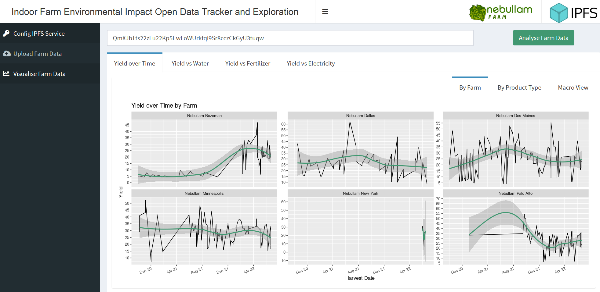

# Sustainable Blockchain Hackathon: Indoor Farm Environmental Impact Data Tracker and Explorer

Nebullam is an indoor vertical farm located in the heart of the Midwest that created their own fulfillment stack, focused on reducing food miles, to serve their local communities year-round though a direct to consumer delivery model.  They are big on data, sustainability and wanted to use this hackathon as an opportunity to explore a novel approach to using blockchain technology for environmental impact tracking inspired by their own efforts to reduce their carbon footprint.

As a way to promote and support open data standards in the indoor farming industry, Nebullam partnered with Omni Analytics Group to develop an application and schema that serves as a proof of concept of how blockchain technology can be utilized to create an immutable record of energy usage for the analysis and study of environmental impact at scale.

View the [video walkthrough](https://youtu.be/oXBEGoD8YR0?list=PLaiSf_XWcFZXBgl9MDujEdbyMDDJ-2uh5) to learn more.

Play with the prototype [here](https://ced3-223-130-29-126.in.ngrok.io/).

Learn more about vertical farming [here](https://youtu.be/1MkRX2fPP58).

## Setup the WebApp on your machine
- [Install IPFS and have the IPFS Daemon running](https://docs.ipfs.io/install/)
- [Install R](https://cran.r-project.org)
- Install following R packages [How to install R packages](https://www.r-bloggers.com/2010/11/installing-r-packages/)
	- tidyverse
	- httr
	- jsonlite
	- shiny
	- shinydashboard
	- qrcode
	- lubridate

## Run the WebApp on your machine
- Open R session
- Clone this repo
- Run in R console `setwd(<<repopath>>)`
- Run in R console `shiny::runApp()`

